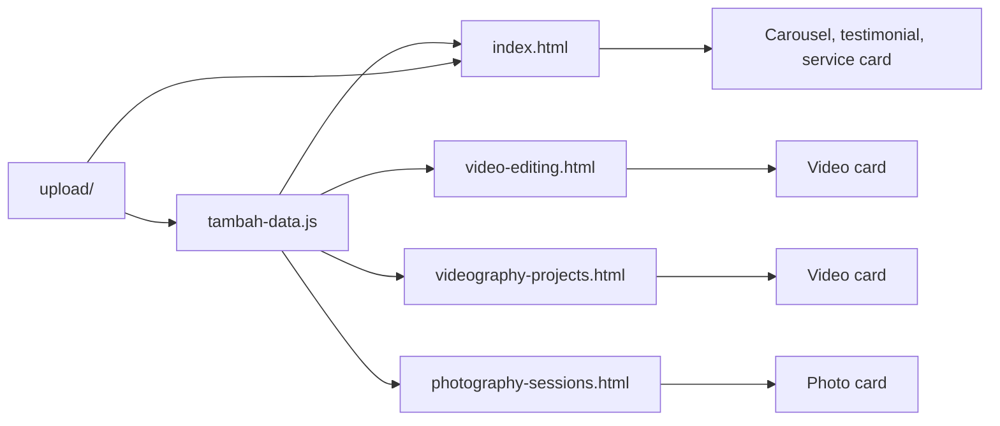

# Dokumentasi Proyek Mario

## 1. Ringkasan

Mario adalah website portofolio statis untuk layanan videografi, fotografi, dan video editing. Website tidak menggunakan framework build seperti React, Vue, atau Vite. Halaman dirender langsung oleh browser menggunakan HTML, CSS, dan JavaScript.

Konten utama dikelola dari satu file data, yaitu `tambah-data.js`. Gambar proyek disimpan terpusat di folder root `upload/`.

## 2. Struktur Proyek

```text
/
|-- index.html
|-- video-editing.html
|-- videography-projects.html
|-- photography-sessions.html
|-- tambah-data.js
|-- DOKUMENTASI-PROYEK.md
|-- PANDUAN-TAMBAH-DATA.md
|-- upload/
|   |-- logo.webp
|   |-- editing.png
|   |-- fotography.jpg
|   |-- jumbotron2.jpg
|   |-- jumbotron3.jpg
|   |-- contoh-data-wisuda1.jfif
|   |-- contoh-data-wisuda2.jfif
|   |-- contoh-data-wisuda3.jfif
|   `-- sulawesi.jpg
`-- assets/
    |-- css/
    |-- fonts/
    `-- js/
```

Folder `assets/` berisi library, stylesheet, font, dan script template. Folder `upload/` berisi aset gambar yang digunakan oleh project ini.

## 3. Halaman Website

### `index.html`

Halaman utama yang berisi:

- Hero section.
- About Me.
- Behind the lens carousel.
- Testimonials.
- Creative Stories carousel.
- Service cards.
- Contact section dan footer.

### `video-editing.html`

Halaman layanan video editing. Data video diambil dari `videoEditingData` dan dirender menjadi card yang berisi judul, iframe YouTube, dan deskripsi.

### `videography-projects.html`

Halaman layanan videography. Data video diambil dari `videographyData` dan menggunakan pola card yang sama dengan halaman video editing.

### `photography-sessions.html`

Halaman layanan photography. Data foto diambil dari `photoData`. Gambar ditampilkan dengan lebar penuh dan tinggi otomatis agar rasio asli gambar tetap terjaga dan foto tidak terpotong.

## 4. File Data Pusat

Semua halaman layanan memuat file berikut:

```html
<script src="tambah-data.js"></script>
```

File tersebut harus dimuat sebelum script renderer pada masing-masing halaman.

`tambah-data.js` berisi beberapa koleksi data:

```javascript
const testimonialData = [];
const behindLensImages = [];
const creativeImages = [];
const serviceData = [];
const videoEditingData = [];
const videographyData = [];
const photoData = [];
```

File tersebut juga menyediakan fungsi input data:

```javascript
addTestimonial(...)
addBehindLensImage(...)
addCreativeImage(...)
addVideo(...)
addPhoto(...)
```

## 5. Alur Data



### Alur homepage

1. Browser memuat library dan `tambah-data.js`.
2. `index.html` membaca `behindLensImages`, `testimonialData`, `creativeImages`, dan `serviceData`.
3. JavaScript membuat slide carousel, baris testimonial, creative slide, dan service card.

### Alur halaman video

1. Browser memuat `tambah-data.js`.
2. Renderer membaca salah satu array video.
3. Link YouTube dikonversi ke URL embed `youtube-nocookie.com`.
4. Card video dibuat ke dalam elemen `#videoGallery`.

### Alur halaman photography

1. Browser memuat `tambah-data.js`.
2. Renderer membaca `photoData`.
3. Setiap item dibuat menjadi photo card.
4. Gambar menggunakan `width: 100%` dan `height: auto`, sehingga seluruh gambar terlihat.

## 6. Sistem Gambar

Semua gambar project menggunakan path relatif dari root website:

```javascript
'upload/nama-file.jpg'
```

Contoh:

```javascript
addPhoto(
  'Foto Wisuda',
  'upload/contoh-data-wisuda1.jfif',
  'Foto dokumentasi wisuda',
  'Dokumentasi sesi foto wisuda.'
);
```

Nama file harus sama persis, termasuk huruf besar-kecil dan ekstensi file.

## 7. Styling

### CSS global project

`assets/css/index.css` mengatur tampilan khusus homepage, termasuk:

- Hero image.
- About card.
- Behind the lens card.
- Testimonials glassmorphism.
- Creative Stories.
- Contact section.
- Service section.

### CSS halaman layanan

CSS untuk `video-editing.html`, `videography-projects.html`, dan `photography-sessions.html` saat ini berada di dalam tag `<style>` pada masing-masing HTML.

Style card utama meliputi:

- Grid responsif.
- Border dan radius card.
- Shadow.
- Hover effect.
- Layout mobile satu kolom.
- Rasio video 16:9.
- Gambar photography dengan tinggi otomatis.

## 8. Library Eksternal

Homepage menggunakan beberapa dependency melalui CDN:

- jQuery.
- Bootstrap JavaScript.
- DataTables.
- Bootstrap bundle.

Karena sebagian dependency dimuat dari internet, koneksi internet diperlukan saat membuka fitur yang bergantung pada CDN. Tidak ada proses build atau instalasi package yang diperlukan.

## 9. Cara Menjalankan Lokal

Karena project bersifat static, halaman dapat dibuka langsung melalui `index.html`. Untuk hasil yang lebih konsisten, gunakan web server lokal dari root project.

Contoh menggunakan Python:

```powershell
python -m http.server 8000
```

Kemudian buka:

```text
http://localhost:8000
```

## 10. Catatan Pemeliharaan

- Tambahkan data konten di `tambah-data.js`, bukan langsung di template card HTML.
- Upload gambar ke folder `upload/` terlebih dahulu.
- Pastikan path gambar menggunakan `upload/`.
- Jangan menghapus nama array yang digunakan oleh renderer.
- Jangan mengubah ID elemen seperti `videoGallery`, `photoGallery`, `creativeSlides`, atau `behindLensSlides` tanpa memperbarui renderer.
- Setelah perubahan, buka semua halaman utama untuk mengecek gambar, card, carousel, dan video.
- Commit perubahan data dan gambar secara bersamaan agar path tidak putus.
